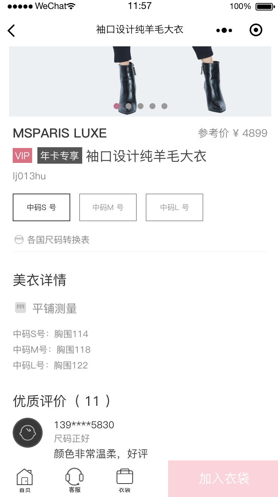
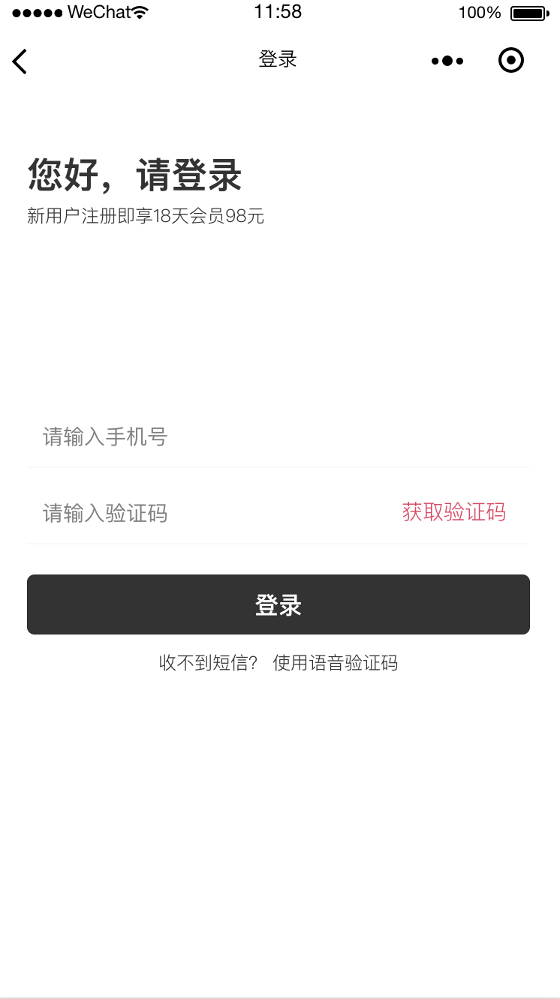

# 前言

基于时装衣橱工程修改（[时装衣橱原始工程](https://github.com/EasyTuan/taro-msparis)），首先感谢EasyTuan的分享。

我们在taro-msparis工程基础上进行修改，数据获取替换为通过 **[GraphQL](https://graphql.cn/)** 的方式请求所要的数据，通过 **[无服务器云函数](https://cloud.tencent.com/product/scf/)** 服务进行部署（无需服务器），从而搭建一整套服务。

我们提供 Graphql 服务端可自动生成并部署至云平台，无需额外搭建服务器，数据库可以使用 **Mongodb**、**fc-db**(基于对象存储)。


目前很多开发者使用Graphql，[React](https://reactjs.org/)中使用 **[Apollo Client](https://www.apollographql.com/docs/react/)** 创建Graphql客户端，但目前**Taro**中暂时还不支持Apollo Client的使用。

我们提供一个graphql cache的库 **[graphql-sync-multi-platform](https://www.npmjs.com/package/graphql-sync-multi-platform)** 可以自动更新数据，同时可以用于taro，该项目的修改就是基于这个库来更新缓存数据。

如果你没有学习过graphql也不用担心，只需了解 **Mongodb** CRUD基本写法即可轻松上手。让我们来看看如何修改这个案例的吧。

# 效果演示

[查看demo请戳这里](http://ms.caibowen.net/)（请用chrome手机模式预览）

### H5版 && 微信小程序版

 

# 技术栈

React + Taro + Dva + GraphQL + Sass + ES6/ES7

## 项目运行

```
git clone git@github.com:IooBot/taro-graphql-fc-msparis.git

cd taro-graphql-fc-msparis

# 使用 npm 或者 yarn 全局安装taro脚手架
npm install -g @tarojs/cli@1.2.26
yarn global add @tarojs/cli@1.2.26

# 项目依赖为1.2.26版本，如要升级，请同时升级项目依赖
# 如用1.2.26版本，请忽略这句
taro update project

# 安装项目依赖
npm install
yarn

# 微信小程序
npm run dev:weapp
yarn run dev:weapp

# H5
npm run dev:h5
yarn run dev:h5

```

## 修改说明

1. 使用Graphql首先得创建schema，将原项目获取的数据分析修改创建schema, 数据结构可见本工程 **taro-msparis-fc.csv** 文件, 通过[ioobot workbench](http://workbench.ioobot.cn)部署至腾讯云。

> taro-msparis graphql Endpoint: http://msparis.ioobot.cn/graphql
> taro-msparis graphql IDE GraphiQL: http://msparis.ioobot.cn/ql

    Mongodb
    host: 119.27.174.13:27017
    db-name：taro_msparis_fc
    username: ioobot
    password: ioobot12345

2. 引入 **[graphql-sync-multi-platform](https://www.npmjs.com/package/graphql-sync-multi-platform)**

/src/config/index.js 添加graphql endpoint url
`export const graphqlEndpoint = 'http://msparis.ioobot.cn/graphql';  // fc`

/src/app.js init后即可使用
```
import * as QL from 'graphql-sync-multi-platform/graphql_cache.core';
import {graphqlEndpoint} from './config';

  componentDidMount() {
    // graphql
    QL.init(graphqlEndpoint, Taro.request);
  }
```

3. 修改数据获取方式

我们采用该项目 我的-> 收货地址 的查询更新来进行举例说明。

src/pages/addressList/model.js  effects  *getAddressList 获取收货地址，原工程通过RESTful方式获取数据。
```javascript
*getAddressList(_, { call, put, select }) {
  const { access_token } = yield select(state => state.common);
  const { status, data } = yield call(addressListApi.getAddressList, {
    access_token,
  });
  if (status === 'ok') {
    yield put({
      type: 'save',
      payload: {
        addressList: data.rows,
      },
    });
  }
}
```
修改如下, 这里我们通过user_id获取用户的收货地址
```javascript
*getAddressList(_, { call, put, select }) {
  const { user_id } = yield select(state => {
    return state.common
  });
  const data = yield call(findMany,{collection:"userAddress", condition: {user_id}, fields:["id", "address_detail","contact_mobile","contact_name","area_name","region_name","region_code"]});

  if(data !== null) {
    yield put({
      type: 'save',
      payload: {
        addressList: data,
      },
    });
  }
}
```

src/utils/crud.js 添加数据查询更新的方法

**` QL.find_many(collection,condition,fields) `**
**` QL.insert(collection,condition,fields) `**
**` QL.update(collection,condition,fields) `**
**` QL.remove(collection,condition) `**

仿mongodb写法，第一个参数是集合名称，第二个参数是查询条件，第三个参数是返回字段名称, 返回Promise。

```javascript
import * as QL from "graphql-sync-multi-platform/graphql_cache.core";

export default (options = {collection:'', condition:'', fields: '',}) => {
  return QL.find_many(options.collection,options.condition,options.fields).then(res => {
    return res;
  });
};
```

4. 修改数据更新方式

src/pages/addressUpdate/model.js  effects  *submit 更新收货地址，原工程通过RESTful方式更新数据。

```javascript
*submit({ payload }, { select, call }) {
  const { access_token } = yield select(state => state.common);
  const { addressId } = yield select(state => state.addressUpdate);
  const { status } = yield call(addressUpdateApi.updateAddress, {
    id: addressId && addressId != '' ? addressId : undefined,
    access_token,
    region_code: payload.showValue.region_code,
    region_name: payload.showValue.region_name,
    contact_name: payload.contact_name,
    contact_mobile: payload.contact_mobile,
    address_detail: payload.address_detail,
  });
  if (status === 'ok') {
    Taro.showToast({
      title: '保存成功',
      icon: 'none',
    });
    setTimeout(() => {
      Taro.navigateBack();
    }, 1000);
  }
}
```
修改如下
```
import {insert, update} from "../../utils/crud";

*submit({ payload }, { select, call }) {
  const { addressId } = yield select(state => state.addressUpdate);
  const { user_id } = yield select(state => {return state.common});
  console.log("addressId:",addressId);

  let data = '';
  let {showValue, contact_name, contact_mobile, address_detail} = payload;
  let {region_code, region_name} = showValue;

  if(addressId){
    data = yield call(update,{collection:"userAddress",condition:{id:addressId},fields:{region_code, region_name, contact_name, contact_mobile, address_detail}});

  }else {
    let id = Math.floor(Math.random() * 1000);
    data = yield call(insert,{collection:"userAddress",condition:{id, region_code, region_name, contact_name, contact_mobile, address_detail, user_id}});
  }

  if(data.result === 'ok'){
    Taro.showToast({
      title: '保存成功',
      icon: 'none',
    });
    setTimeout(() => {
      Taro.navigateBack();
    }, 1000);
  }
}
```

**` QL.remove(collection,condition) `**  return Promise

```
*removeAddress(_, { call, select }) {
  const addressId = yield select(state => state.addressUpdate.addressId);

  QL.remove("userAddress",{id:addressId}).then((data)=>{
    if(data === 'ok'){
      Taro.showToast({
        title: '删除成功',
        icon: 'none',
      });
      setTimeout(() => {
        Taro.navigateBack();
      }, 1000);
    }
  });
}
```

## 项目说明

目录结构

    ├── .temp                  // H5编译结果目录
    ├── .rn_temp               // RN编译结果目录
    ├── dist                   // 小程序编译结果目录
    ├── config                 // Taro配置目录
    │   ├── dev.js                 // 开发时配置
    │   ├── index.js               // 默认配置
    │   └── prod.js                // 打包时配置
    ├── screenshots            // 项目截图，和项目开发无关
    ├── site                   // H5静态文件（打包文件）
    ├── src                    // 源码目录
    │   ├── components             // 组件
    │   ├── config                 // 项目开发配置
    │   ├── images                 // 图片文件
    │   ├── models                 // redux models
    │   ├── pages                  // 页面文件目录
    │   │   └── home
    │   │       ├── index.js           // 页面逻辑
    │   │       ├── index.scss         // 页面样式
    │   │       ├── model.js           // 页面models
    │   │       └── service.js        // 页面api
    │   ├── styles             // 样式文件
    │   ├── utils              // 公共方法库
    │   ├── app.js             // 项目入口文件
    │   └── index.html
    ├── package.json
    └── template.js            // pages模版快速生成脚本,执行命令 npm run tep `文件名`

## 技术介绍

**Taro** 是一套遵循 [React](https://reactjs.org/) 语法规范的 **多端开发** 解决方案。现如今市面上端的形态多种多样，Web、React-Native、微信小程序等各种端大行其道，当业务要求同时在不同的端都要求有所表现的时候，针对不同的端去编写多套代码的成本显然非常高，这时候只编写一套代码就能够适配到多端的能力就显得极为需要。

使用 **Taro**，我们可以只书写一套代码，再通过 **Taro** 的编译工具，将源代码分别编译出可以在不同端（微信/百度/支付宝/字节跳动小程序、H5、React-Native 等）运行的代码。

**GraphQL** GraphQL 对你的 API 中的数据提供了一套易于理解的完整描述，使得客户端能够准确地获得它需要的数据，而且没有任何冗余，也让 API 更容易地随着时间推移而演进，还能用于构建强大的开发者工具。

**Serverless** 在无需购买和管理服务器的情况下运行代码。您只需使用平台支持的语言编写核心代码并设置代码运行的条件，即可在云平台基础设施上弹性、安全地运行代码。

## 部分截图展示

### 首页 && 商品详情

 

### 衣袋 && 我的

 

### 登录 && 优惠券

 


# 文档

### Taro开发文档

> https://nervjs.github.io/taro/docs/README.html

### dva开发文档地址

> https://dvajs.com/

### 微信小程序官方文档

> https://mp.weixin.qq.com/debug/wxadoc/dev/

### GraphQL 入门

> https://graphql.cn/learn/

### Serverless 介绍

#### 腾讯云无服务器云函数 SCF

> https://cloud.tencent.com/product/scf/

#### 阿里云函数计算

> https://www.aliyun.com/product/fc?spm=5176.8142029.388261.163.41626d3e60rRSX

# 联系我们

>  如果对您有帮助，您可以点右上角 "Star" 支持一下 谢谢！ ^_^

>  我们会不断提供可参考的案例，敬请期待

>  如有您有问题或想法可以联系我们，或在 Issues 中提出

   

# License

[MIT](LICENSE)
